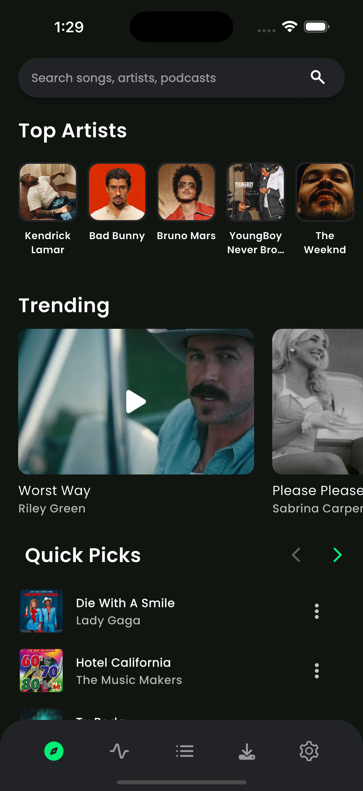
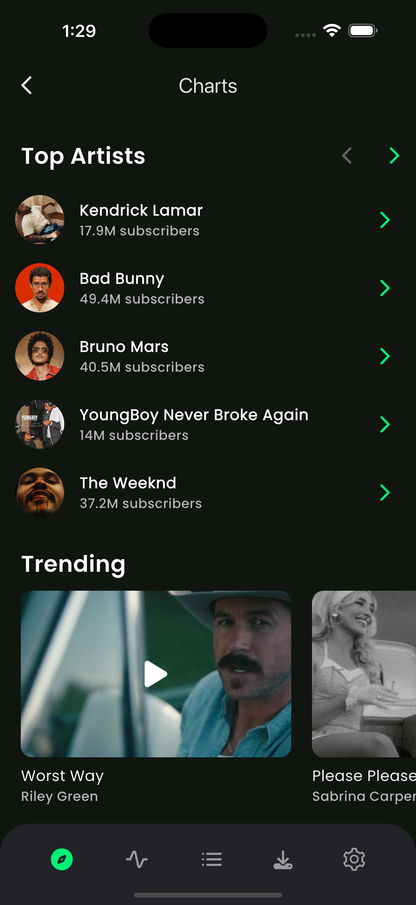
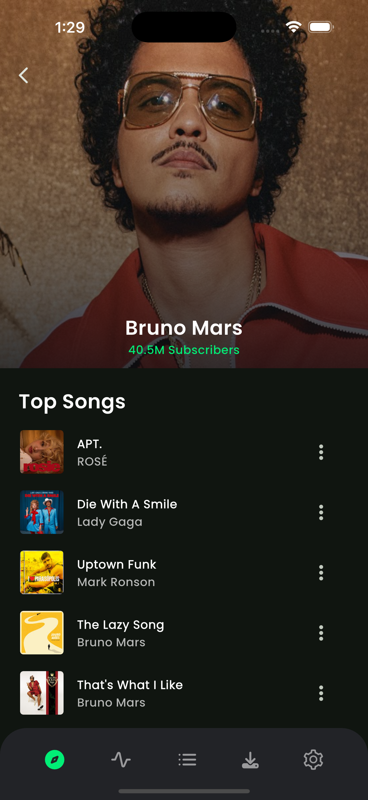
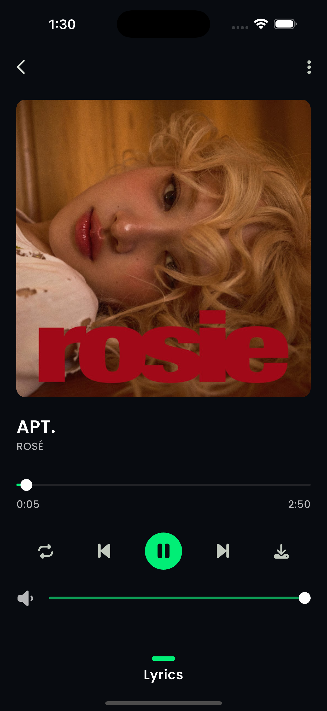
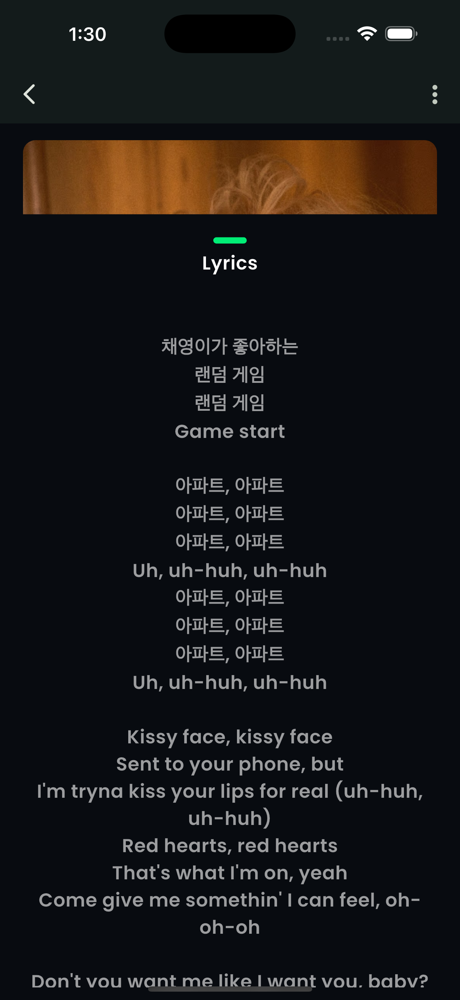
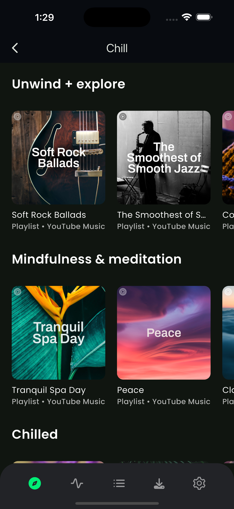
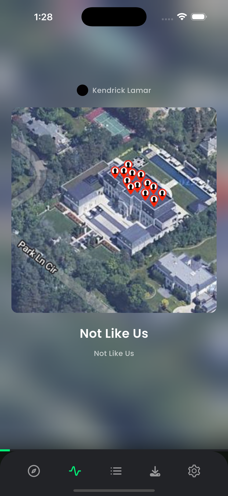
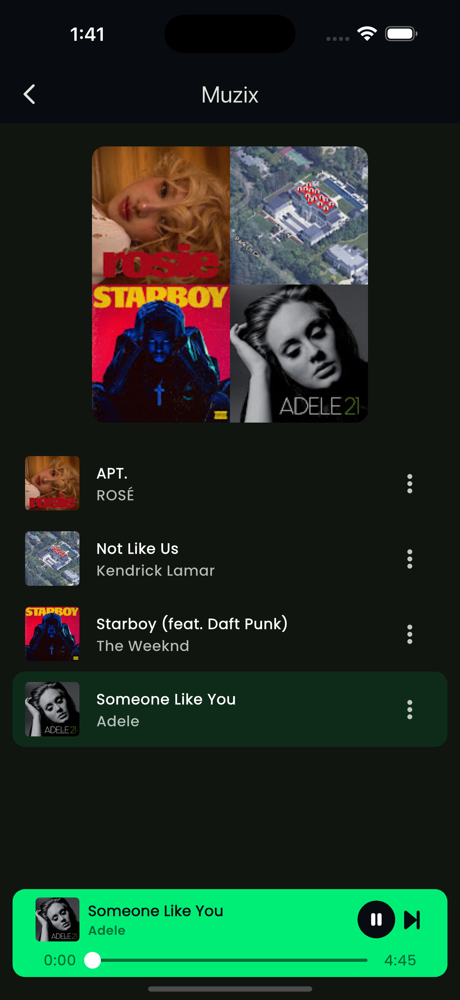
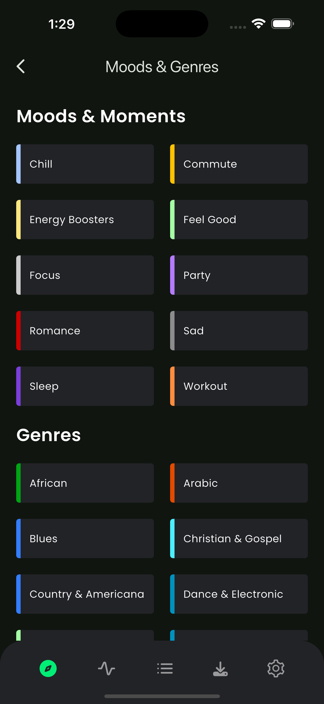
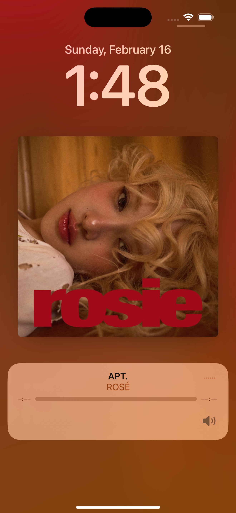

# 📌 Rhythmic Realm

🚀 **Rhythmic Realm** is not just a music app—it's a culmination of everything I've learned over the past 3 years. From best practices in Flutter development, UI/UX design, and performance optimization, this project represents the highest quality standards that developers can learn from and use as a reference.

---

## 📷 Screenshots

|  |  |  |
|------------|------------|------------|
|  |  |  |
|  |  |  |
|  |

---

## 📥 Installation
Clone the repository and run:
```sh
flutter pub get
```

---

## 📥 Run the app
Before running the app:
1. Create an account at [RapidAPI](https://rapidapi.com/) and then grab an API key from [here.](https://rapidapi.com/Paxsenix0/api/youtube-music-api3)
2. Create a new .env file at the root of the project repository and add your API key:
```sh
RAPIDAPI_MUSIC_KEY=<YOUR_API_KEY>
```
3. Then run the following command to run the app:
```sh
flutter run
```

---

## 🛠️ Built With
- Flutter
- Dart

---

## License
This project is licensed under the **MIT Non-Commercial (MIT-NC) License**.  
You are free to use and modify this project for learning and personal use.  
**Commercial use, rebranding, or business-related activities are strictly prohibited.**  
See the [LICENSE](./LICENSE) file for more details.

---

## 🤝 Contributing
We welcome contributions! Feel free to fork this repository and submit a PR.

1. Fork the repository.
2. Create a new branch (`feature-branch`).
3. Commit your changes.
4. Open a pull request.

---

## 🔗 Connect with Me
💼 [LinkedIn](https://www.linkedin.com/in/mrsoserious/)  
📧 [Email](mailto:huzefakhety786@email.com)  
🌐 [Portfolio](https://hozefakhety.in/)